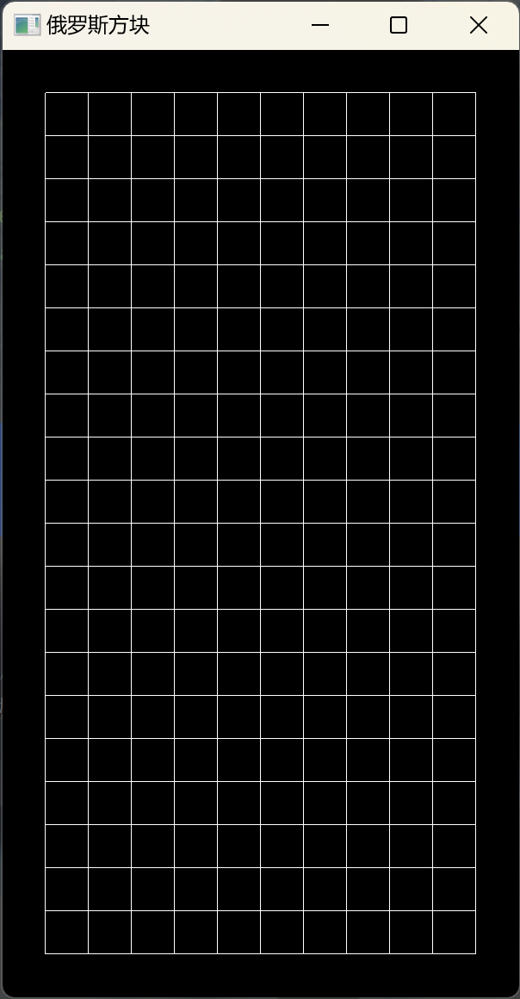
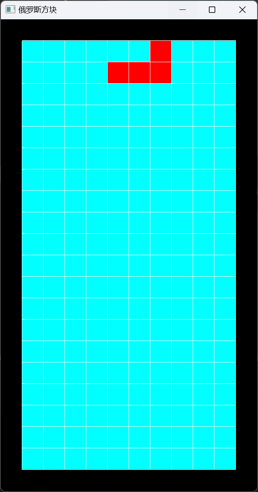

# Tetris 俄罗斯方块
OpenGL实现的俄罗斯方块

## 棋盘网格
网格线点的位置
```c++
    glm::vec4 line_points[line_points_num]; // 线点集
    for (int i = 0; i <= cube_num_w; i++) { // 竖线
        line_points[2 * i] = {cube_size * (i + 1), cube_size, 0, 1}; // 线下端点
        line_points[2 * i + 1] = line_points[2 * i] + glm::vec4{0, cube_num_h * cube_size, 0, 0}; // 线上端点
    }
    int points_h_num = 2 * (cube_num_w + 1); // 竖线点数量
    for (int i = 0; i <= cube_num_h; i++) { // 横线
        line_points[points_h_num + 2 * i] = {cube_size, cube_size * (i + 1), 0, 1}; // 线左端点
        line_points[points_h_num + 2 * i + 1] =
                line_points[points_h_num + 2 * i] + glm::vec4{cube_num_w * cube_size, 0, 0, 0}; // 线右端点
    }
    glGenVertexArrays(1, &line_points_VAO);
    glBindVertexArray(line_points_VAO);
    glGenBuffers(1, &line_points_VBO);
    glBindBuffer(GL_ARRAY_BUFFER, line_points_VBO);
    glBufferData(GL_ARRAY_BUFFER, line_points_num * sizeof(glm::vec4), line_points, GL_STATIC_DRAW);
    glVertexAttribPointer(0, 4, GL_FLOAT, GL_FALSE, 0, 0);
    glEnableVertexAttribArray(0);
```
网格线点的颜色全白
```c++
    glm::vec4 line_points_colors[line_points_num]; // 线点颜色集
    for (auto &line_points_color: line_points_colors) {
        line_points_color = {1, 1, 1, 1}; // 白点
    }
    glGenBuffers(1, &line_points_colors_VBO);
    glBindBuffer(GL_ARRAY_BUFFER, line_points_colors_VBO);
    glBufferData(GL_ARRAY_BUFFER, line_points_num * sizeof(glm::vec4), line_points_colors, GL_STATIC_DRAW);
    glVertexAttribPointer(1, 4, GL_FLOAT, GL_FALSE, 0, 0);
    glEnableVertexAttribArray(1);
```

## 方块
计算出全部方块点的位置，一个方块两个三角形六个顶点
```c++
        glm::vec4 cube_all_points[cube_points_num]; // 全部方块点位置
        for(int i=0;i<cube_num_h;i++){
            for(int j=0;j<cube_num_w;j++){
                glm::vec4 p1={cube_size*(j+1),cube_size*(i+1),0,1};
                glm::vec4 p2=p1+glm::vec4 {0,cube_size,0,0};
                glm::vec4 p3=p1+glm::vec4 {cube_size,0,0,0};
                glm::vec4 p4=p1+glm::vec4 {cube_size,cube_size,0,0};
                int number=6*(cube_num_w*i+j); // 一个方块两个三角形六个顶点
                cube_all_points[number]=p1;
                cube_all_points[number+1]=p2;
                cube_all_points[number+2]=p3;
                cube_all_points[number+3]=p2;
                cube_all_points[number+4]=p3;
                cube_all_points[number+5]=p4;
            }
        }
        glGenVertexArrays(1, &cube_all_VAO);
        glBindVertexArray(cube_all_VAO);
        glGenBuffers(1, &cube_all_VBO);
        glBindBuffer(GL_ARRAY_BUFFER, cube_all_VBO);
        glBufferData(GL_ARRAY_BUFFER, cube_points_num * sizeof(glm::vec4), cube_all_points, GL_STATIC_DRAW);
        glVertexAttribPointer(0, 4, GL_FLOAT, GL_FALSE, 0, 0);
        glEnableVertexAttribArray(0);
```
方块点颜色
```c++
        for(auto&cube_all_color:cube_all_colors){
            cube_all_color={0,1,1,1}; // 全部方块点的颜色
        }
        glGenBuffers(1, &cube_all_colors_VBO);
        glBindBuffer(GL_ARRAY_BUFFER, cube_all_colors_VBO);
        glBufferData(GL_ARRAY_BUFFER, cube_points_num * sizeof(glm::vec4), cube_all_colors, GL_STATIC_DRAW);
        glVertexAttribPointer(1, 4, GL_FLOAT, GL_FALSE, 0, 0);
        glEnableVertexAttribArray(1);
```

## 俄罗斯方块
先开辟顶点对象
```c++
    // 画俄罗斯的四个方块
    {
        glGenVertexArrays(1, &Tetris_VAO); // 俄罗斯方块
        glBindVertexArray(Tetris_VAO);
        glGenBuffers(1, &Tetris_VBO); // 方块位置
        glBindBuffer(GL_ARRAY_BUFFER,Tetris_VBO);
        glBufferData(GL_ARRAY_BUFFER, 24 * sizeof(glm::vec4), nullptr, GL_STATIC_DRAW);
        glVertexAttribPointer(0, 4, GL_FLOAT, GL_FALSE, 0, nullptr);
        glEnableVertexAttribArray(0);
        glGenBuffers(1,&Tetris_colors_VBO);
        glBindBuffer(GL_ARRAY_BUFFER, Tetris_colors_VBO); // 方块点颜色
        glBufferData(GL_ARRAY_BUFFER, 24 * sizeof(glm::vec4), nullptr, GL_DYNAMIC_DRAW);
        glVertexAttribPointer(1, 4, GL_FLOAT, GL_FALSE, 0, nullptr);
        glEnableVertexAttribArray(1);
    }
```
更新俄罗斯方块的位置，由方块中心位置和相对偏移计算出每个方块顶点的位置
```c++
// 更新俄罗斯方块的位置
void updateTetrisPosition() {
    glBindBuffer(GL_ARRAY_BUFFER, Tetris_VBO);
    for (int i=0;i<4;i++) { // 计算四个方块的位置
        // 由相对位置计算出方块的位置
        float x = TetrisPosition.x + TetrisCubes[i].x;
        float y = TetrisPosition.y + TetrisCubes[i].y;
        // 计算方块四个点位置
        glm::vec4 p1 = {cube_size * (x + 1), cube_size * (y + 1), 0, 1};
        glm::vec4 p2 = p1 + glm::vec4{0, cube_size, 0, 0};
        glm::vec4 p3 = p1 + glm::vec4{cube_size, 0, 0, 0};
        glm::vec4 p4 = p1 + glm::vec4{cube_size, cube_size, 0, 0};
        glm::vec4 tetris_points[6]={p1,p2,p3,p2,p3,p4};
        glBufferSubData(GL_ARRAY_BUFFER, i*6*sizeof(glm::vec4), 6*sizeof(glm::vec4), tetris_points);
    }
}
```
生成新的俄罗斯方块，随机旋转方向，确定方块颜色，更新方块位置
```c++
// 生成新的俄罗斯方块
void newTetris(){
    TetrisPosition={5, 18}; // 初始位置中心
    std::random_device rd;  // 使用随机设备作为种子
    std::mt19937 gen(rd()); // 使用 Mersenne Twister 作为随机数引擎
    std::uniform_int_distribution<int> dis(0, 3); // 生成 [0,3] 范围内的随机整数
    int rotation=dis(gen); // 随机旋转方向
    for(int i=0;i<4;i++){ // 生成一种俄罗斯方块
        TetrisCubes[i]=Tetris_L[rotation][i];
    }
    glm::vec4 TetrisColors[24];
    for (auto & TetrisColor : TetrisColors)
        TetrisColor = {1,0,0,1};
    glBindBuffer(GL_ARRAY_BUFFER, Tetris_colors_VBO);
    glBufferSubData(GL_ARRAY_BUFFER, 0, sizeof(TetrisColors), TetrisColors);
    updateTetrisPosition();
}
```

## 旋转俄罗斯方块
检测方块位置合法性
```c++
bool isPositionValid(glm::vec2 cubePosition) {
    if (cubePosition.x >= 0 && cubePosition.x < cube_num_w && cubePosition.y >= 0 && cubePosition.y < cube_num_h)
        return true;
    return false;
}
```
俄罗斯方块不同的旋转方式已经使用数组的方式存储下来，改变旋转方式只需要改变俄罗斯方块的位置索引
```c++
// 旋转俄罗斯方块
void rotateTetris() {
    int nextRotation = (rotation + 1) % 4;
    for (int i = 0; i < 4; i++) {
        if (!isPositionValid(TetrisPosition + Tetris_L[nextRotation][i]))
            return;
    }
    rotation = nextRotation;
    for (int i = 0; i < 4; i++) { // 生成一种俄罗斯方块
        TetrisCubes[i] = Tetris_L[rotation][i];
    }
    updateTetrisPosition();
}
```
处理键盘输入，向上（up或者w）旋转方块，使用glfwGetKey会在短时间内多次读取键盘输入状态，使用glfwSetKeyCallback结合press和repeat则不会
```c++
// 处理键盘输入事件
void key_callback(GLFWwindow *window, int key, int scancode, int action, int mode) {
    if (action == GLFW_PRESS || action == GLFW_REPEAT) {
        if (key == GLFW_KEY_ESCAPE)
            glfwSetWindowShouldClose(window, true);
        else if (key == GLFW_KEY_W) {
            rotateTetris();
        } else if (key == GLFW_KEY_S) {}
        else if (key == GLFW_KEY_A) {}
        else if (key == GLFW_KEY_D) {}
    }
}
```
## 移动俄罗斯方块
移动俄罗斯方块中心位置，判断移动后位置是否合法
```c++
// 移动俄罗斯方块
void moveTetris(glm::vec2 move) {
    glm::vec2 newPosition[4];
    for (int i = 0; i < 4; i++) {
        newPosition[i] = TetrisPosition + move + TetrisCubes[i];
        if (!isPositionValid(newPosition[i]))
            return;
    }
    TetrisPosition += move;
    updateTetrisPosition();
}
```
更新键盘输入处理
```c++
// 处理键盘输入事件
void key_callback(GLFWwindow *window, int key, int scancode, int action, int mode) {
    if (action == GLFW_PRESS || action == GLFW_REPEAT) {
        if (key == GLFW_KEY_ESCAPE)
            glfwSetWindowShouldClose(window, true);
        else if (key == GLFW_KEY_W) {
            rotateTetris();
        } else if (key == GLFW_KEY_S) {
            moveTetris({0,-1});
        } else if (key == GLFW_KEY_A) {
            moveTetris({-1,0});
        } else if (key == GLFW_KEY_D) {
            moveTetris({1,0});
        }
    }
}
```

## 放置俄罗斯方块
放置俄罗斯方块就是改变某个位置方块的颜色，对于一个方块的位置，更新其对应六个顶点的颜色
```c++
// 改变单个方块的颜色
void changeCubeColor(glm::vec2 cubePosition, glm::vec4 color) {
    int offset = 6 * (cubePosition.x + cubePosition.y * cube_num_w);
    glm::vec4 colors[6] = {color, color, color, color, color, color};
    glBindBuffer(GL_ARRAY_BUFFER, cube_all_colors_VBO);
    glBufferSubData(GL_ARRAY_BUFFER, offset * sizeof(glm::vec4), sizeof(colors), colors);
    for (int i = 0; i < 4; i++) {
        cube_all_colors[offset + i] = color;
    }
}
```
一个俄罗斯方块由四个方块组成，更新这四个方块位置的颜色，并标记位置为已经填充
```c++
// 放置俄罗斯方块
void settleTetris() {
    for (int i = 0; i < 4; i++) {
        glm::vec2 position = TetrisPosition + TetrisCubes[i];
        int x = position.x;
        int y = position.y;
        cube_filled[x][y] = true;
        changeCubeColor(position, red);
    }
}
```
更新下落事件，当无法下落说明这里就是该方块的归宿
```c++
// 处理键盘输入事件
void key_callback(GLFWwindow *window, int key, int scancode, int action, int mode) {
    if (action == GLFW_PRESS || action == GLFW_REPEAT) {
        if (key == GLFW_KEY_ESCAPE)
            glfwSetWindowShouldClose(window, true);
        else if (key == GLFW_KEY_W) {
            rotateTetris();
        } else if (key == GLFW_KEY_S) { // 如果不能下落说明到位置放置了
            if (!moveTetris({0, -1})) {
                settleTetris();
                newTetris();
            }
        } else if (key == GLFW_KEY_A) {
            moveTetris({-1, 0});
        } else if (key == GLFW_KEY_D) {
            moveTetris({1, 0});
        }
    }
}
```
增加方块位置合法性检测，让方块叠起来，如果该位置已经被方块填充，位置无效
```c++
// 检查方块位置合法性
bool isPositionValid(glm::vec2 cubePosition) {
    if (cubePosition.x >= 0 && cubePosition.x < cube_num_w && cubePosition.y >= 0 && cubePosition.y < cube_num_h &&
        !cube_filled[(int) cubePosition.x][(int) cubePosition.y])
        return true;
    return false;
}
```

## 七种俄罗斯方块
I、T、O、J、L、Z、S

使用相对于中心的位移来表示每种俄罗斯方块的形状，并表示出四种旋转方式的相对位移
```c++
// 七种俄罗斯方块，四种旋转方式，相对于中心的位置偏移
glm::vec2 TetrisTypes[7][4][4] = {
        {{glm::vec2(0, 0),  glm::vec2(-1, 0), glm::vec2(1, 0),  glm::vec2(-1, -1)},    //   L
                {glm::vec2(0, 1),  glm::vec2(0, 0),  glm::vec2(0, -1), glm::vec2(1, -1)},   //
                {glm::vec2(1, 1),  glm::vec2(-1, 0), glm::vec2(0, 0),  glm::vec2(1, 0)},   //
                {glm::vec2(-1, 1),  glm::vec2(0, 1),  glm::vec2(0, 0),  glm::vec2(0, -1)}},

        {{glm::vec2(0, 0),  glm::vec2(-1, 0), glm::vec2(0, -1), glm::vec2(-1, -1)},   // O
                {glm::vec2(0, 0),  glm::vec2(-1, 0), glm::vec2(0, -1), glm::vec2(-1, -1)},
                {glm::vec2(0, 0),  glm::vec2(-1, 0), glm::vec2(0, -1), glm::vec2(-1, -1)},
                {glm::vec2(0, 0),   glm::vec2(-1, 0), glm::vec2(0, -1), glm::vec2(-1, -1)}},

        {{glm::vec2(-2, 0), glm::vec2(-1, 0), glm::vec2(0, 0),  glm::vec2(1, 0)},    // I
                {glm::vec2(0, 1),  glm::vec2(0, 0),  glm::vec2(0, -1), glm::vec2(0, -2)},   //
                {glm::vec2(-2, 0), glm::vec2(-1, 0), glm::vec2(0, 0),  glm::vec2(1, 0)},   //
                {glm::vec2(0, 1),   glm::vec2(0, 0),  glm::vec2(0, -1), glm::vec2(0, -2)}},

        {{glm::vec2(0, 0),  glm::vec2(1, 0),  glm::vec2(0, -1), glm::vec2(-1, -1)},    // S
                {glm::vec2(0, 1),  glm::vec2(0, 0),  glm::vec2(1, 0),  glm::vec2(1, -1)},   //
                {glm::vec2(0, 0),  glm::vec2(1, 0),  glm::vec2(0, -1), glm::vec2(-1, -1)},   //
                {glm::vec2(0, 1),   glm::vec2(0, 0),  glm::vec2(1, 0),  glm::vec2(1, -1)}},

        {{glm::vec2(0, 0),  glm::vec2(-1, 0), glm::vec2(0, -1), glm::vec2(1, -1)},    // Z
                {glm::vec2(0, -1), glm::vec2(0, 0),  glm::vec2(1, 0),  glm::vec2(1, 1)},   //
                {glm::vec2(0, 0),  glm::vec2(-1, 0), glm::vec2(0, -1), glm::vec2(1, -1)},   //
                {glm::vec2(0, -1),  glm::vec2(0, 0),  glm::vec2(1, 0),  glm::vec2(1, 1)}},

        {{glm::vec2(0, 0),  glm::vec2(-1, 0), glm::vec2(1, 0),  glm::vec2(1, -1)},    // J
                {glm::vec2(0, 1),  glm::vec2(0, 0),  glm::vec2(0, -1), glm::vec2(1, 1)},   //
                {glm::vec2(-1, 1), glm::vec2(-1, 0), glm::vec2(0, 0),  glm::vec2(1, 0)},   //
                {glm::vec2(-1, -1), glm::vec2(0, 1),  glm::vec2(0, 0),  glm::vec2(0, -1)}},

        {{glm::vec2(0, 0),  glm::vec2(-1, 0), glm::vec2(1, 0),  glm::vec2(0, -1)},    //  T
                {glm::vec2(0, 1),  glm::vec2(0, 0),  glm::vec2(0, -1), glm::vec2(1, 0)},   //
                {glm::vec2(0, 1),  glm::vec2(-1, 0), glm::vec2(0, 0),  glm::vec2(1, 0)},   //
                {glm::vec2(-1, 0),  glm::vec2(0, 1),  glm::vec2(0, 0),  glm::vec2(0, -1)}}
};
```
七种对应颜色
```c++
glm::vec4 red = {1, 0, 0, 1};
glm::vec4 blue = {0, 0, 1, 1};
glm::vec4 yellow = {0.9, 0.9, 0, 1};
glm::vec4 cyan = {0, 1, 1, 1};
glm::vec4 orange = {1, 0.5, 0, 1};
glm::vec4 green = {0, 1, 0, 1};
glm::vec4 purple = {1, 0, 1, 1};
glm::vec4 TetrisTypeColors[7] = {orange, yellow, cyan, red, green, blue, purple};
```
随机形状和颜色
```c++
// 生成新的俄罗斯方块
void newTetris() {
    TetrisPosition = {5, 18}; // 初始位置中心
    std::random_device rd;  // 使用随机设备作为种子
    std::mt19937 gen(rd()); // 使用 Mersenne Twister 作为随机数引擎
    std::uniform_int_distribution<int> disRotation(0, 3); // 生成 [0,3] 范围内的随机整数
    rotation = disRotation(gen); // 随机旋转方向
    std::uniform_int_distribution<int> disType(0, 6); // 生成 [0,6] 范围内的随机整数
    Type = disType(gen); // 随机形状
    for (int i = 0; i < 4; i++) { // 生成一种俄罗斯方块
        TetrisCubes[i] = TetrisTypes[Type][rotation][i];
    }
    glm::vec4 TetrisColors[24];
    for (auto &TetrisColor: TetrisColors)
        TetrisColor = TetrisTypeColors[Type];
    glBindBuffer(GL_ARRAY_BUFFER, Tetris_colors_VBO);
    glBufferSubData(GL_ARRAY_BUFFER, 0, sizeof(TetrisColors), TetrisColors);
    updateTetrisPosition();
}
```
